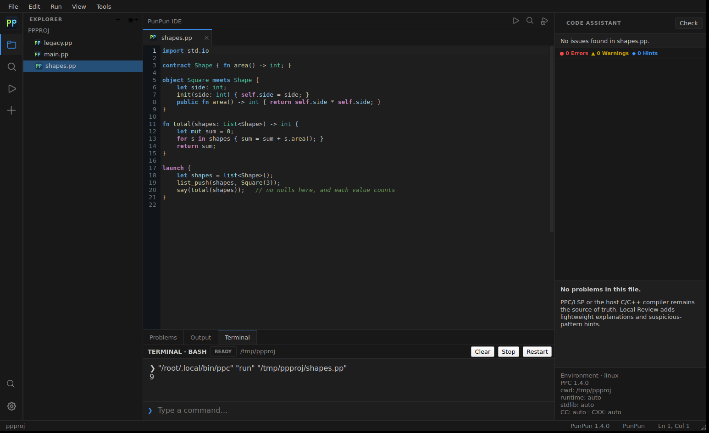

<h1 align="center">PunPun IDE</h1>

<p align="center">
  A native desktop IDE for <a href="https://github.com/pumpumlang/punpun">PunPun</a>, C and C++.<br>
  C++20 and Qt 6. No Electron, no bundled browser, no second compiler.
</p>

<p align="center">
  
  
  
  
</p>

<p align="center">
  
</p>

## What it is

An editor, a project tree, real compiler diagnostics and a working terminal, in
one native window. PPC — the PunPun compiler — is the source of truth for
everything semantic: the IDE runs `ppc serve --stdio` for live semantics and
`ppc check --json` for explicit checks, rather than maintaining a second,
disagreeing idea of the language.

Press <kbd>F5</kbd> and the program builds and runs in the terminal below the
editor, in the file's own directory, with its output where you are looking.

## Install

### Linux

Download `PunPun-IDE-v<version>-x86_64.AppImage` from the
[latest release](https://github.com/pumpumlang/punpun-ide/releases/latest),
mark it executable once, and open it:

```sh
chmod +x PunPun-IDE-v*-x86_64.AppImage
./PunPun-IDE-v*-x86_64.AppImage
```

The AppImage carries Qt, libarchive and their dependencies, so nothing else
needs installing.

### Windows

Run `PunPun-IDE-<version>-win64.exe` from the same release. It installs to
Program Files with Start-menu and desktop shortcuts and an uninstaller.
`PunPun-IDE-v<version>-windows-x64.zip` is the portable alternative: unpack and
double-click `bin\punpun-ide.exe`.

### The PunPun toolchain

Install PunPun itself to run and check `.pp` files:

```sh
curl -fsSL https://raw.githubusercontent.com/pumpumlang/punpun/main/install.sh | sh
```

The IDE finds it without any further setup. It looks in `~/.local/bin` (where
the installer puts it), `~/.punpun/bin`, `/usr/local/bin`, `/opt/punpun/bin`,
`$PUNPUN_PREFIX`, its own managed toolchain directory, the open project's
`build/` directory, and `PATH` — in that order.

> Finding it only through `PATH` is not enough, and this is worth knowing if you
> package a PunPun tool yourself: the installer extends `PATH` by appending to
> your shell profile, and a program started from a desktop icon, a `.desktop`
> entry or an AppImage never reads those files. That is why the Run button used
> to do nothing on a freshly installed system.

If discovery still misses your installation, set the directory explicitly under
**Settings → Toolchain**. It takes priority over everything else, and the IDE's
terminal inherits it too. Without any toolchain the editor, C/C++ support and
terminal still work, and Run says exactly what it could not find and where it
looked.

## Features

**Editing.** Indentation carries across Enter and steps in after a block opens.
Brackets and quotes close as you type, typing a closer steps over it, and
backspace between a fresh pair removes both. Matching delimiters highlight near
the caret. Every one of these is switchable under **Settings → Editor**.

**Diagnostics.** Compiler and LSP findings render as gutter markers and wave
underlines; hovering a squiggle shows the diagnostic and a suggested next step.
The Code Assistant panel groups them by severity with the code, the likely
cause, and what to do about it.

**Offline analysis.** A local layer answers while a buffer is unsaved or no
toolchain is installed. Its vocabulary is transcribed from PPC's own keyword
and builtin tables, so it names the same migration spellings the compiler
does — and stands down on any line the compiler has already spoken about.

**Terminal.** Keeps shell working directory and exported variables across
commands, preserves history, shows partial prompts immediately, and sends what
you type to a running child program instead of queueing it as another shell
command.

**Languages.** PunPun, C, C++, headers, Markdown, JSON, JavaScript and Python
are highlighted. C and C++ are checked live from the unsaved buffer with the
host compiler's `-fsyntax-only`.

**Toolchain updates.** The IDE follows the official GitHub
`releases/latest`, downloads into private app data, verifies SHA-256,
smoke-tests PPC, and only then switches the IDE, LSP and terminal over. Your
system installation is never overwritten.

Also included: a PPX package-manager GUI, a native plugin ABI, and an
environment doctor written in PunPun itself.

## Shortcuts

| Action | Shortcut | | Action | Shortcut |
| --- | --- | --- | --- | --- |
| Run | <kbd>F5</kbd> | | Open file | <kbd>Ctrl</kbd>+<kbd>O</kbd> |
| Debug | <kbd>Ctrl</kbd>+<kbd>F5</kbd> | | Open folder | <kbd>Ctrl</kbd>+<kbd>K</kbd> <kbd>Ctrl</kbd>+<kbd>O</kbd> |
| Check | <kbd>Ctrl</kbd>+<kbd>Shift</kbd>+<kbd>B</kbd> | | Save | <kbd>Ctrl</kbd>+<kbd>S</kbd> |
| Terminal | <kbd>Ctrl</kbd>+<kbd>`</kbd> | | Find | <kbd>Ctrl</kbd>+<kbd>F</kbd> |
| Code Assistant | <kbd>Ctrl</kbd>+<kbd>Shift</kbd>+<kbd>A</kbd> | | Complete | <kbd>Ctrl</kbd>+<kbd>Space</kbd> |
| Toggle comment | <kbd>Ctrl</kbd>+<kbd>/</kbd> | | Format | <kbd>Shift</kbd>+<kbd>Alt</kbd>+<kbd>F</kbd> |
| Indent / outdent | <kbd>Tab</kbd> / <kbd>Shift</kbd>+<kbd>Tab</kbd> | | Duplicate line | <kbd>Ctrl</kbd>+<kbd>Shift</kbd>+<kbd>D</kbd> |
| Move lines | <kbd>Alt</kbd>+<kbd>↑</kbd> / <kbd>↓</kbd> | | | |

All of them are editable in Settings.

## Build from source

Requirements: a C++20 compiler, CMake 3.24+, Qt 6.4+ (Widgets, Network, Svg,
Qml, and Test for the test suite) and libarchive.

```sh
cmake -S . -B build -G Ninja -DCMAKE_BUILD_TYPE=Release
ninja -C build
./build/punpun-ide
```

Run the tests:

```sh
ctest --test-dir build --output-on-failure
```

On Arch and CachyOS, `./run.sh` installs missing build dependencies,
configures, builds and launches in one step (`--rebuild`, `--test`,
`--no-launch`). To produce an AppImage: `./scripts/build_appimage.sh`.

## How PunPun is driven

PPC remains the semantic source of truth. The IDE does not maintain a second
PunPun compiler.

| Purpose | Command |
| --- | --- |
| Language service | `ppc serve --stdio` |
| Run a file | `ppc run file.pp` |
| Explicit diagnostics | `ppc check --json file.pp` |
| Formatting | `ppc fmt file.pp` |
| Environment probe | bundled `resources/punpun/doctor.pp` |

## Architecture

Each language has a job rather than being mixed in for decoration:

- **C++20 + Qt 6** — windowing, editor, Explorer, terminal, Run/Check/Debug,
  LSP client, package manager, settings and updater.
- **C11** — the stable native plugin and file-type ABI in
  `c_api/punpun_plugin_api.h`.
- **JavaScript** — sandboxed language-extension metadata and snippets through
  `QJSEngine`. Scripts get no filesystem or shell objects.
- **Python 3** — source audit, tests and release packaging only; never in the
  finished application's path.

`src/PunPunLanguage.h` holds the language vocabulary in one place, transcribed
from the compiler's `token.hpp` and `builtins.cpp`, so the highlighter, the
completer and the analyzer cannot drift apart from each other or from PPC.

## Validation

`ctest` runs the ABI and bridge tests, the editor and analyzer behaviour tests
under Qt's offscreen platform, the terminal protocol test, and an 84-check
source and resource audit. Linux x86-64 is the validated platform; Windows is
release-qualified through its own workflow.

## Related

| Repository | Contents |
| --- | --- |
| [`punpun`](https://github.com/pumpumlang/punpun) | The language: compiler, runtime, standard library |
| [`punpun-ppx`](https://github.com/pumpumlang/punpun-ppx) | PPX package manager and registry |
| [`punpun-docs`](https://github.com/pumpumlang/punpun-docs) | Documentation site and reference |

## Assets

PunPun branding is used for `.pp`. Microsoft Fluent UI System Icons provide the
app chrome and Material Icon Theme provides the C/C++/header/Markdown/JSON/
JavaScript/Python file icons. Source links and license notices are under
`resources/`.

PunPun IDE is distributed under the [MIT License](LICENSE).
